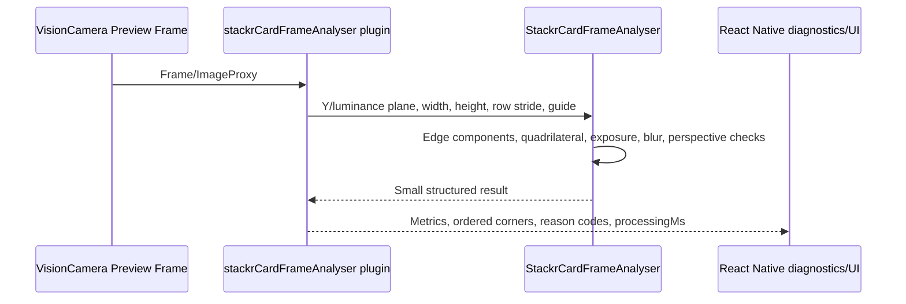

# Prompt 4: Native Card Frame Analyser

Date: 2026-07-26

## Summary

Prompt 4 adds the first real `StackrCardVision` image-processing component without changing production scanner behavior. The analyser is a native luminance-frame quality gate that identifies whether a single card-shaped quadrilateral is present and whether the preview frame is usable for later recognition.

The versioned quality configuration is:

`stackr-card-frame-analyser-v1.0.0`

No full preview frames, photos, base64 payloads, OCR text, API keys, or user identifiers are returned by the analyser.

## What Changed

- Added a shared TypeScript result contract and reference analyser in `lib/cardVisionFrameAnalyser.ts`.
- Added Android native analyser types, luminance-plane processing, procedural fixture tests, and benchmark hooks under `modules/stackr-card-vision/android`.
- Added Android VisionCamera frame processor plugin registration under the stable plugin name `stackrCardFrameAnalyser`.
- Added iOS native analyser core for `CVPixelBuffer` luminance analysis plus matching procedural fixture and benchmark hooks.
- Extended the development-only Card Vision diagnostics screen to show native fixture-test and benchmark reports.
- Added procedural image fixtures that cover the required success and failure cases without bundling card artwork or user photos.

## Result Contract

The analyser returns:

```ts
{
  cardDetected: boolean;
  corners: {
    topLeft: { x: number; y: number };
    topRight: { x: number; y: number };
    bottomRight: { x: number; y: number };
    bottomLeft: { x: number; y: number };
  } | null;
  fillRatio: number;
  aspectRatioScore: number;
  blurScore: number;
  glareRatio: number;
  underexposureRatio: number;
  overexposureRatio: number;
  perspectiveScore: number;
  allCornersVisible: boolean;
  edgeClipped: boolean;
  qualityAccepted: boolean;
  failureReasons: CardFrameAnalyserFailureReason[];
  processingMs: number;
}
```

Corner coordinates are ordered and normalized to the analysed frame, where `0..1` covers the frame width and height.

## Stable Failure Reasons

Failure reasons are ordered deterministically:

```text
NO_CARD
MULTIPLE_CARDS
LOW_FILL
ASPECT_RATIO
BLUR
GLARE
UNDEREXPOSED
OVEREXPOSED
PERSPECTIVE
CORNER_OCCLUDED
EDGE_CLIPPED
LOW_CONFIDENCE_RECTANGLE
NON_CARD_RECTANGLE
```

## Native Data Flow



The Android plugin reads `ImageProxy.planes[0]` natively. It copies only the Y plane inside native memory for analysis and never sends the frame or base64 data to JavaScript.

The iOS core exposes `analysePixelBuffer(_:)` and reads the first plane from `CVPixelBuffer`. Live iOS VisionCamera plugin registration is deliberately not forced in this prompt because this Windows workspace has no iOS project to validate and VisionCamera frame processors are currently disabled by the missing `react-native-worklets-core` package.

## Fixture Coverage

Procedural fixtures cover:

- no card
- correctly framed card
- rotated card
- severe perspective
- blurred card
- glare
- dark image
- clipped edge
- finger over corner
- two visible cards
- rectangular non-card object

For multiple-card fixtures, the analyser returns `MULTIPLE_CARDS` and does not silently choose one candidate.

## Benchmark Commands

Reference benchmark:

```powershell
npx tsx scripts/benchmark-card-frame-analyser-fixtures.ts
```

Native benchmark hooks available in a development build:

```ts
benchmarkNativeCardFrameAnalyserFixtures(120)
```

The native benchmark functions process at least 100 procedural luminance fixtures and return `medianMs`, `p95Ms`, and `maxMs`.

## Current Native Prerequisite Blocker

The repo has:

- `react-native-vision-camera` 4.7.3
- `react-native-worklets` 0.5.1
- no `react-native-worklets-core`

VisionCamera 4.7.3 disables frame processors when `react-native-worklets-core` is not installed. The Android plugin is registered defensively, and diagnostics report the availability state. This prompt does not install that dependency or change scanner production behavior.

## What Must Stay Untouched

- Existing Expo Camera still-capture scanner flow.
- Existing OCR, legacy recognition, catalogue, marketplace, binder, listing, grading, and Supabase flows.
- API keys and recognition providers.
- Camera UI safe-area/header behavior; that belongs to a scanner UI prompt, not this native analyser task.
