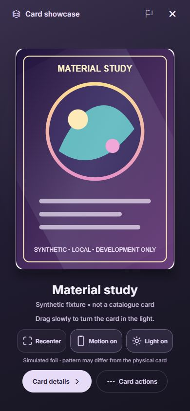
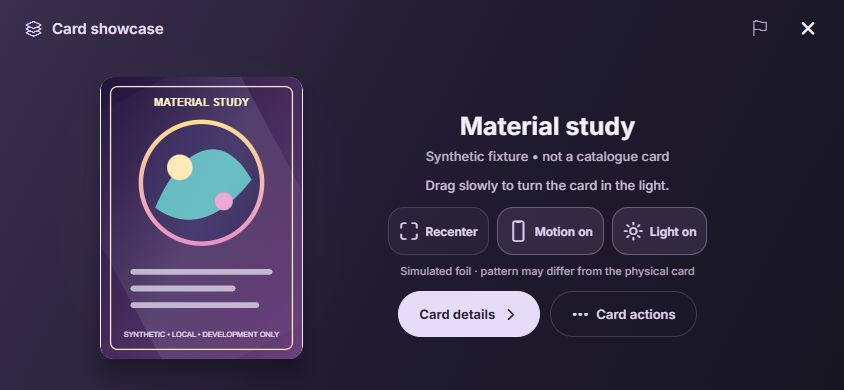
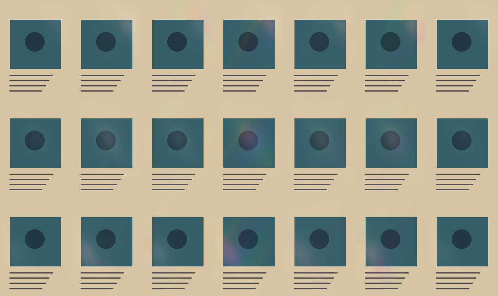

# Card showcase — 1 October 2026

The shared long-press card viewer now presents catalogue artwork on a quiet plum
stage, with motion-driven foil, a moving shadow and an occasional soft tactile
cue when the phone makes a deliberate tilt sweep. It retains the existing image
cache, exact printing/language/variant selection, card details and binder actions.

Base: `3faf8edf4602258cef36ca08b7abd96cabcc3cc6`, following the delivered 1.0.4 (49).
This is a source candidate for the next reviewed client release. No EAS build,
submission, OTA, backend deployment or production data mutation was performed.

## Interaction and design

- Large uninterrupted card front; Inter typography and a plum/silver palette
  (`#211C31`, `#39304D`, `#171522`, `#E7DCF7`, `#C2B5D2`). The card carries the
  colour; surrounding controls stay quiet. Landscape places the details beside
  the card. Short screens and enlarged text can scroll.
- Motion and simulated light can each be switched off for the current inspection;
  Recenter resets orientation. These controls do not overwrite saved preferences.
- Native calibrated rotation stays on the Reanimated UI thread. Small translation,
  perspective and shadow movement share the same bounded input. Drag remains a
  fallback. No timer animates an untouched card.
- Native Skia foil separates a broad reflection, directional spectral crest and
  fine glints. Six existing material modes remain selected by canonical finish,
  rather than name, rarity or an invented visual classification.
- The existing crisp opening haptic remains. A soft tilt cue requires neutral
  arming, a high threshold crossing and an 800 ms cooldown; returning through the
  lower threshold rearms it. Only an actual crossing bridges to JS. Generation
  and foreground checks expire queued cues on pause, recenter, background and
  close, including after preference hydration. Web never dispatches haptics.
- Sensors and material pause before artwork loads and while paused, inactive,
  backgrounded or Reduce Motion is enabled. Saved haptics preferences still apply.
  The effect never applies to seller/owned-condition photographs.

## References and fidelity

[Simey's live reference](https://poke-holo.simey.me/) was viewed for its separation
of rotation, moving light and foil response. The implementation extends Stackr's
original renderer and uses no reference code or texture assets; see the
[reference audit](../holographic-reference-audit.md). The owner's additional
"lab website" URL has not been supplied, so no claim is made to have reviewed it.

The verified printing-specific mask registry remains empty. Recorded foil finishes
receive disclosed generic simulated lighting; this does not reproduce a physical
card's individual embossing or foil boundary. Existing verified mask precedence
and identity guards remain intact. Web uses a limited gradient approximation,
with neutral glare on plain cards and a restrained cool highlight for foil;
it is not the native Skia rendering.

## Verification

- `npm run test:card-inspection`: all 11 scripts passed. Includes 37 motion cases,
  24 lifecycle cases, 31 actual SkSL compile/pixel cases, 8 web-surface cases,
  13 viewer behavior cases, and existing haptic/identity/navigation checks.
- `npm run typecheck`: passed. `npm run lint`: no errors, 10 existing warnings in
  unrelated files. Focused validation does not claim native-device execution.
- Native shader CPU/WASM pixels: diagonal crest peak alpha **43 → 78** and
  textured crest **30 → 39** on a 0–255 scale from rest to deliberate tilt, using
  native material strengths. Both stay below the **113** pixel opacity ceiling.
  These are bounded fixture measurements, not perceived brightness or phone FPS.
- Actual Expo web development route checked at **390×844**, **844×390**, and
  **320×568**. Open/close, drag, pause/resume, disabled controls and deferred card
  details were inspected. The fixture is original geometric study art with
  explicit synthetic identity; it performs no catalogue request or data write.

The native shader's seven synthetic material columns and three tilt positions:

## Remaining device acceptance

### 2 October: remove the white frame at the card edge

Both preview and full-resolution artwork now use a transparent image-frame
background in this viewer. The previous theme surface showed through the rounded
corners and contain-fit side gutters as a white rim. The original artwork, its
printed border and contain-fit sizing are preserved. The development web fixture
was visually checked after reload; all 13 existing viewer behavior cases pass.
This is a client source correction, not a new TestFlight delivery.

### Phone checks

Install the next reviewed native/compatible client candidate and test a recorded
holo printing, a plain printing, an unknown finish, saved-language variants and a
condition photograph. Confirm tilt direction in portrait/landscape, artwork
readability, the soft cue, pause/close/background cancellation, Reduce Motion and
haptics off. Measure frame time and battery on the phone before claiming smooth
60 fps or a performance improvement. This change does not resolve artwork,
checklist, logo, metadata or pricing backlogs, and does not establish catalogue
completeness or sub-0.5-second retrieval.

Rollback: revert this scoped client change through the normal reviewed delivery
path. There are no new native dependencies, data migrations or remote flags.
