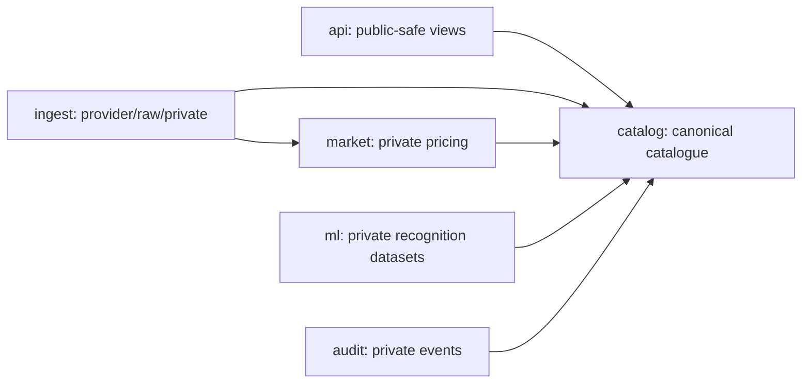
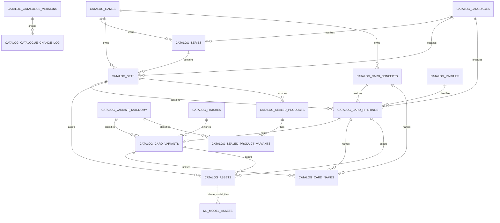
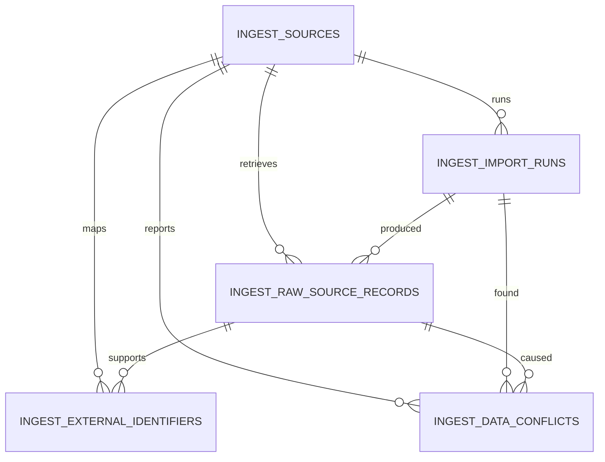
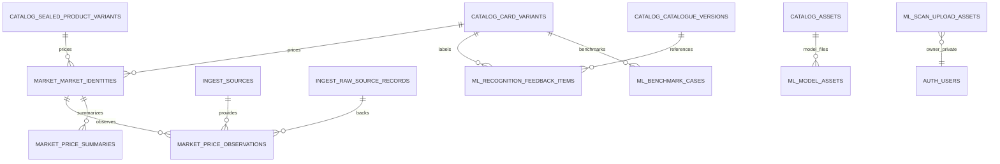
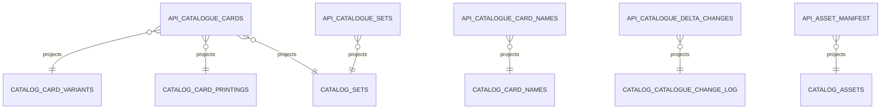

# Canonical Catalogue Entity Relationship

Audit/stage date: 2026-07-28
Migrations:

- `supabase/migrations/20260727212256_canonical_stackr_catalogue_database.sql`
- `supabase/migrations/20260728060617_stackr_asset_repository_delivery_pipeline.sql`

Scope: additive local/repository migration only. No production Supabase migration was pushed.

## Schema Boundaries



Public/mobile reads should use `api` views or safe `catalog` reads. `ingest`, `ml`, `audit` and private `market` tables are service-only.

## Core Catalogue ERD



## Provider And Provenance ERD



External identifiers target exactly one canonical entity at a time: series, set, card concept, printing, variant, sealed product, sealed-product variant or asset. Active external IDs are unique by source, source entity type, external ID and language, while deprecated rows preserve historical identifiers.

## Market And Recognition ERD



`market.market_identities` separates `raw_card`, `graded_card` and `sealed_product`. These identities are not combined.

## Public API Projections



The `api` views are `security_invoker` views and expose only safe fields. They intentionally exclude:

- raw provider payloads;
- provider credentials or secret-bearing metadata;
- internal notes;
- licensing review notes;
- private feedback/training image paths.

## Canonical Identity Rule

Card names and aliases are searchable metadata, not identity.

Canonical card-variant identity is:

```text
game_code + language_code + canonical set id + collector_number + variant_code
```

The migration enforces this with `catalog.card_variants.canonical_key` and a unique constraint. The same artwork can be shared across variants through `artwork_key` without being unique.

## Delta Sync

`catalog.catalogue_versions` stores published catalogue package/version metadata.

`catalog.catalogue_change_log` stores a monotonic `change_sequence` for mobile delta sync. Public-safe mobile changes are exposed through `api.catalogue_delta_changes`.

## RLS And Exposure Summary

| Schema | Intended exposure | Grants/RLS |
| --- | --- | --- |
| `catalog` | Public-safe catalogue reads; admin/service writes | `anon` and `authenticated` get read-only grants; admin writes use `catalog.is_catalog_admin()`; service role can manage. |
| `api` | Public-safe projections | `anon` and `authenticated` get select on safe views. |
| `ingest` | Private provider/raw data | Service role only. |
| `market` | Private market identities/observations/summaries | Service role only in this migration. |
| `ml` | Private benchmark/feedback metadata | Service role only. |
| `audit` | Private operational event logs | Service role only. |
