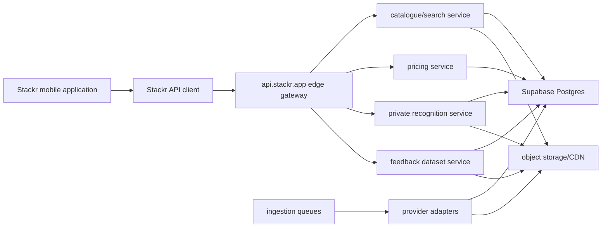

# Stackr API Target Architecture

Audit date: 2026-07-27
Stage scope: target design only. No API route, database schema, Edge Function or deployment was implemented in Stage 1.

## Required Flow

```text
Stackr mobile application
-> Stackr API client
-> api.stackr.app edge gateway
-> catalogue/search service
-> Supabase Postgres
-> private recognition service
-> object storage/CDN
-> ingestion queues and provider adapters
```

## Target Diagram



## Design Principles

- Preserve the current mobile UI and scanner behavior while service calls move behind feature flags.
- Version public API routes, beginning with `/v1`.
- Retain Supabase Auth initially, but stop exposing catalogue, pricing, provider and feedback implementation details directly to the mobile app.
- Keep Supabase service-role keys, database passwords, Cloudflare secrets, eBay secrets and provider credentials server-only.
- Keep Ximilar/CardSight/current cloud fallback available until Stackr-owned recognition benchmarks pass.
- Use additive, reversible migrations only. Do not run destructive production migrations.
- Do not identify cards by card name alone. Canonical identity must include game, language, canonical set identity, collector number and variant/finish identity.
- Store source name, raw source ID, retrieval time, provider-updated time when available, source URL where allowed, licence/rights status, transformation version and raw payload or raw-payload hash for each imported record.
- Add request IDs, structured logs, route timing, error codes and measurable acceptance criteria from the first route.

## Component Responsibilities

### Stackr Mobile Application

The app should:

- Continue using Supabase Auth while API auth is introduced.
- Use a typed Stackr API client for catalogue/search/pricing/recognition/feedback.
- Send the Supabase bearer token to the API when authenticated user context is required.
- Generate or forward a request ID for scanner and pricing workflows.
- Keep direct Supabase/provider paths as feature-flagged fallback during migration.
- Avoid putting any privileged credential in `EXPO_PUBLIC_*`, Expo config, source files or bundled assets.

### Stackr API Client

The client should own:

- Base URL and API version.
- Request ID generation/forwarding.
- Auth bearer forwarding.
- Timeout, retry and offline behavior.
- Typed response contracts.
- Feature-flagged fallback to current direct paths.

### Edge Gateway

`api.stackr.app` should own:

- Request ID normalization and response headers.
- Auth verification and role mapping.
- Rate limiting and abuse controls.
- Structured logging.
- API version routing.
- Provider credential isolation.
- Routing to catalogue, pricing, recognition, feedback and admin services.

### Catalogue/Search Service

The catalogue/search service should own:

- Canonical game, language, series, set, printing, variant, rarity, finish and asset reads.
- Search normalization across English, Japanese, Simplified Chinese, Traditional Chinese and Korean.
- Exact identity keys and provider mappings.
- Name and alias search without using name as the unique identity.
- Backward-compatible projections for app screens currently reading `pokemon_cards`, `pokemon_sets`, `tcg_cards` and `tcg_sets`.
- Delta-sync catalogue versions and change sequences for the mobile app.

### Supabase Postgres

Supabase remains the system of record initially. Stage 2 should create or migrate toward private schemas where compatible:

- Public-safe API projections in `api`.
- Canonical catalogue in `catalog`.
- Provider ingestion state and raw records in `ingest`.
- Public-safe price projections and private observations in `market`.
- Recognition/feedback/benchmark datasets in `ml`.
- Security and operational event logs in `audit`.

Do not expose `ingest`, `ml`, `audit` or private `market` tables directly through the Supabase Data API.

### Pricing Service

The pricing service should:

- Separate verified/sold evidence from active listing/asking-price indicators.
- Store provenance and confidence for every observation.
- Keep raw provider payloads private.
- Provide public-safe price summaries with freshness and insufficiency states.
- Use queues for refresh rather than direct client provider calls.

### Private Recognition Service

The recognition service should:

- Validate image size, dimensions, content type and request rate.
- Handle crop/rectification/OCR evidence from the scanner.
- Search Stackr-owned local indexes when enabled.
- Call Ximilar/CardSight/legacy providers only as temporary fallback.
- Log provider decisions, confidence, no-match reasons, fallback use and latency.
- Link feedback to reviewed datasets without exposing private image buckets.

### Object Storage/CDN

Object storage should hold:

- Permitted card images and set assets.
- Private recognition-feedback images.
- Private scan-lab/training captures.
- Generated scanner packs and catalogue packs.

CDN exposure must be based on licence/rights status. Feedback and scan-lab buckets should be private with API-mediated or signed upload/download flows.

### Ingestion Queues And Provider Adapters

Provider adapters should run in controlled backend workers. Each adapter must:

- Obey provider terms, authentication, rate limits, robots rules and licence restrictions.
- Store attribution and raw provider identifiers.
- Use idempotent import runs.
- Produce conflicts instead of silently overwriting canonical records.
- Avoid destructive deletes; use deprecation/correction metadata.

## Public-Safe API Projection

Public/mobile responses must exclude:

- Raw provider payloads.
- Provider credentials or secret-bearing metadata.
- Internal notes.
- Licensing-review internals.
- Private feedback/training image paths.
- Unreviewed benchmark labels.

Public-safe catalogue projections may expose:

- Stable Stackr IDs and canonical keys.
- Game, language, set, collector number and variant labels.
- Display names and aliases marked safe for public use.
- Public image URLs only when licence status allows them.
- Price summaries with source category, freshness and confidence, not raw provider payloads.

## First API Slices

Only after the migration drift is reconciled, the safest first routes are:

- `GET /v1/health`
- `GET /v1/catalogue/cards/:id`
- `GET /v1/catalogue/search`
- `GET /v1/catalogue/sets`
- `GET /v1/prices/cards/:id`
- `POST /v1/scanner/events`
- `POST /v1/recognition/identify` in shadow/fallback-preserving mode only

Do not begin with collection writes, payments, trade writes or destructive user operations.

## Stage 2 Acceptance Criteria

Stage 2 must prove:

- Lint, type checking, relevant tests and migration tests pass.
- Every new API response includes a request ID.
- Structured logs include request ID, route version, user context where safe, timing and outcome.
- No service-role or provider credential is exposed to the client bundle.
- Public-safe projections exclude raw payloads and licensing-review internals.
- Existing scanner UI and fallback behavior remain unchanged when new flags are off.
- Read-only API facade matches current Supabase data for selected cards, sets and prices in tests.
- Rollback is a feature-flag switch back to current direct paths.

## Go/No-Go From Stage 1

Recommendation: no-go for production Stage 2 database migration until Supabase migration history, live/local table drift, Edge Function drift and security advisor findings are reconciled.

Limited go is acceptable for local-only design/prototype work that does not deploy, push migrations, change production schema or remove fallbacks.
