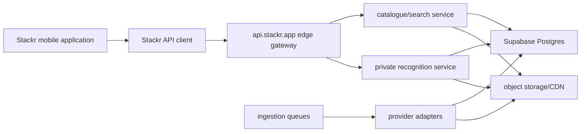

# Stackr API Target Architecture

Stage scope: target design only. No API implementation was performed in Stage 1.

## Required Flow

```text
Stackr mobile application
-> Stackr API client
-> api.stackr.app edge gateway
-> catalogue/search service
-> Supabase Postgres
-> private recognition service
-> object storage/CDN
-> ingestion queues and provider adapters
```

## Architecture Diagram



## Principles

- Version every public API route under a stable contract such as `/v1`.
- Keep Supabase service-role keys, database credentials and provider credentials server-only.
- Preserve existing app UI and scanner behaviour while replacing direct data paths behind feature flags.
- Keep Ximilar and current visual recognition providers available as temporary fallback until Stackr's own benchmark passes.
- Do not identify cards by name alone. Canonical identity must include language, set, collector number and variant/finish where available.
- Store source provider, raw provider identifier, retrieval time, raw payload, source URL where permitted and licence/rights status for imported records.
- Add request IDs, structured logs and route-level timing to all API routes.
- Use reversible, additive migrations. Avoid destructive data changes.
- Publish measurable acceptance criteria before switching any app flow from direct Supabase/provider access to the API.

## Component Responsibilities

### Stackr Mobile Application

The app should keep Supabase Auth initially, but data reads/writes should move behind the API client in staged slices. Client-visible env vars must only contain public configuration. Scanner image upload should use explicit consent and signed/API-mediated upload flows.

### Stackr API Client

The client should own:

- API base URL and version.
- Auth bearer forwarding from Supabase session.
- Request ID generation when missing.
- Retry and timeout policy.
- Typed request/response contracts.
- Feature-flagged fallback to current code paths during migration.

### Edge Gateway

`api.stackr.app` should own:

- Request ID normalization and response headers.
- Auth verification.
- Rate limits and abuse controls.
- Structured logging.
- Route versioning.
- Provider credential isolation.
- Routing to catalogue, pricing, recognition, feedback and admin services.

### Catalogue/Search Service

The catalogue/search service should own:

- Canonical card, set, printing, variant and sealed-product reads.
- Search normalization across English, Japanese, Simplified Chinese, Traditional Chinese and Korean.
- Exact identity keys and provider mappings.
- Backward-compatible projections for current app screens while direct table access is retired.

### Supabase Postgres

Supabase remains the system of record initially. It should hold canonical catalogue tables, user collection data, pricing observations/snapshots, feedback datasets and provider provenance. Stage 2 must first create an authoritative schema snapshot because the app references legacy tables not fully created in committed migrations.

### Private Recognition Service

The recognition service should be private behind the gateway and should own:

- Image validation and preprocessing.
- OCR evidence handling.
- Local visual index search.
- Ximilar/CardSight/legacy fallback calls.
- Recognition request logs.
- Shadow-mode comparison.
- Feedback dataset linkage.

### Object Storage/CDN

Object storage should hold permitted card images, scanner training images, recognition feedback images and generated packs. Public CDN exposure must depend on rights/licence status. Private feedback and scan-lab buckets should remain private with API-mediated upload/download.

### Ingestion Queues And Provider Adapters

Provider adapters should run in queue workers, not mobile clients. Each adapter must enforce source-specific rate limits, licence/rights checks, robots/auth/paywall constraints and attribution storage.

## API Surface To Introduce First

Stage 2 should start with read-only and low-risk facade routes:

- `GET /v1/health`
- `GET /v1/catalogue/cards/:id`
- `GET /v1/catalogue/search`
- `GET /v1/catalogue/sets`
- `GET /v1/prices/cards/:id`
- `POST /v1/recognition/identify` in shadow or fallback-preserving mode only
- `POST /v1/scanner/events`

Do not begin by moving collection writes, payments or destructive user operations until auth, RLS equivalence, request logging and rollback paths are proven.

## Acceptance Criteria For Stage 2

- Every new route returns a request ID and writes structured logs.
- No service-role or provider credential is exposed to the client bundle.
- Existing scanner UI and current fallback behaviour remain available behind feature flags.
- Read-only API facade matches current app data for selected cards/sets/prices in tests.
- Stage 2 adds tests before switching production client traffic.
- Rollback is a feature-flag switch back to current direct paths plus removal of new route traffic.

## Go/No-Go From Stage 1

Recommendation: limited go for Stage 2 API facade and instrumentation only. No-go for replacing the scanner primary path or removing Ximilar/CardSight fallbacks, because local recognition assets are blocked and multilingual coverage is incomplete.
